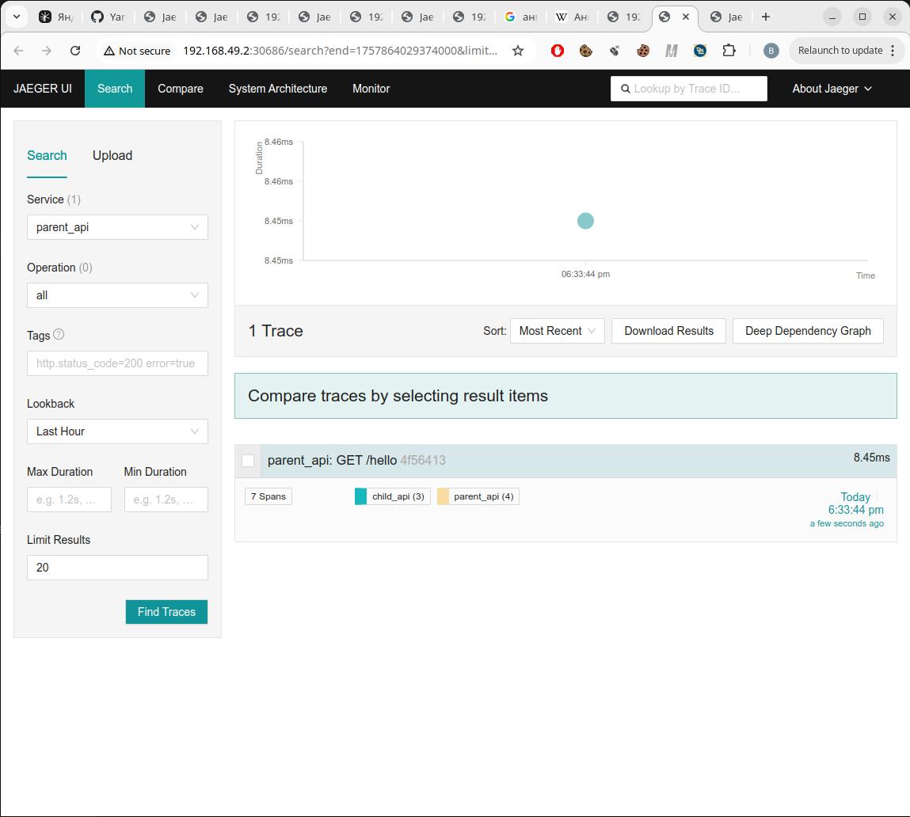
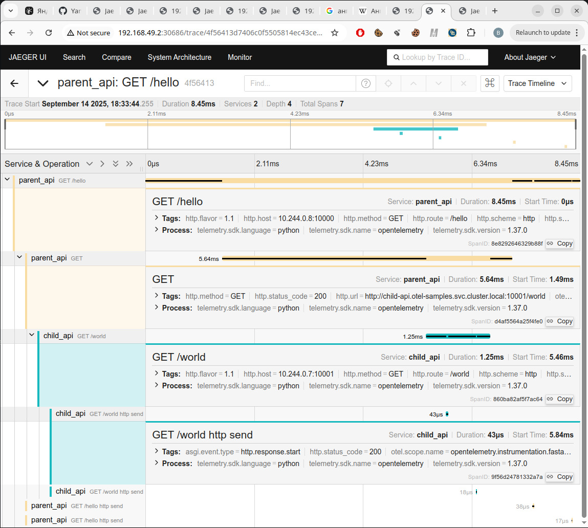

# Задание 3.1. Трейсинг с OpenTelemetry и Jaeger

Здесь есть 2 минималистичных приложения, отправляющие телеметрию в Jaeger через OpenTelemetry:
- `parent_api` с методом `hello` (вызвает `child_api`, метод `world`, httpx-вызов тоже покрыт телеметрией);
- `child_api` с методом `world`.

## Что в каком файле лежит:
### Docker и исходники:
- `Dockerfile` для сборки 2 минималистичных FastAPI-приложений: `parent_api` и `child_api` и их родительского образа.
- `common_api/server.py`: код запуска unvicorn-сервера и включения телеметрии
- `parent_api/`: код `parent_api`, FastAPI-приложения с методом `hello`
- `child_api/`: код `child_api`, FastAPI-приложения с методом `world`
- `pyproject.toml`: настройки для сборки `uv`.

### Kubernetes-ресурсы:
- `install_jaeger.sh`: установка helm chart'а bitnami/jaeger + дополнтельного NodePort для него
- `jaeger-nodeports.yaml` -- NodePort для Jaeger, чтобы его можно было смотреть извне minikube
- `otel-samples.yaml` -- манифест со StatefulSet и NodePort для `parent_api` и `child_api`

## Как запуститься

Включаем minikube:
```bash
bash setup_minikube.sh
```

Устанавливаем наши ресурсы (у меня стартовало минут за 5):

```bash
bash create_namespaces.sh  
bash install_jaeger.sh  # Helm chart c Jaeger + NodePort для него, чтобы видеть Jaeger снаружи minikube
kubectl apply -f otel-samples.yaml -n otel-samples  # И сами примеры parent_api и child_api, а также NodePort для них

echo "Ждем готовности подов и сервисов otel-samples"
kubectl wait --for=condition=ready pod/child-api-0 -n otel-samples --timeout=300s
kubectl wait --for=condition=ready pod/parent-api-0 -n otel-samples --timeout=300s
kubectl get services -n otel-samples  # Проверяем, что NodePort сервисы созданы
```

Получаем ссылки, куда зайти, чтобы вызвать метод `parent_api --> hello` и посмотреть по нему телеметрию в Jaeger:
```bash
echo "Чтобы вызвать метод Parent API:" http://$(minikube ip):30000/hello
# тут должны вернуть "Parent API: hello,\n\"Child API: world!\""

echo "Чтобы зайти в Jaeger:" http://$(minikube ip):30686/search?service=parent_api
# Тут нужно нажать кнопку "Find Traces", и там появятся свежие запуски телеметрии 
```
## Скриншоты




