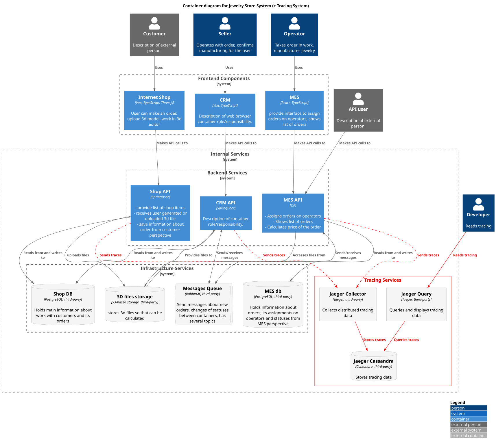

# Задание 3. Трассировка

# Контекст

Часть IT-ланшдафта фирмы “Александрит”, отвечающая за обработку заказов, выполнена в виде системы микросервисов, взаимодействующих между собой различными способами:

- через REST API;  
- через RabbitMQ;  
- через периодическое чтение общей БД.

На работу этих сервисов есть многочисленные жалобы на потерю заказов, однако отследить, на каком этапе происходят сбои, пока не удаётся.

# Предлагаемое решение

**Важно: поддержку телеметрии стоит выполнять уже после поддержки централизованного сбора логов (хотя бы для того, чтобы можно было удобно отлаживать отправку телеметрии). К тому же, логи нам всё равно нужны для более детальной информации об ошибке, когда телеметрия нам подскажет, где её искать.**

## Для девопсов

- Развернуть Jaeger для сбора и визуализации телеметрии (из стандартного helm chart от bitnami);  
- Включить отправку OpenTelemetry-данных в Jaeger во всех сервисах собственной разработки (MES API, Shop API, CRM API).

## Для разработчиков

Добавить поддержку телеметрии в:

- методы обработки HTTP-запросов в собственных сервисах;  
- методы, отправляющие сообщения в очередь или читающие из неё;  
- обращения по HTTP к другим сервисам;  
- добавить метаданные телеметрии ко всем сообщениям, помещаемым в очередь.

Неочевидную синхронизацию сервисов Shop API и CRM API с периодическим поиском обновлений в БД перевести на более прозрачную синхронизацию через сообщения в очереди, добавить метаданные телеметрии и к этим сообщениям.

Для фронтэнд-разработчиков: добавить **отключаемую** поддержку телеметрии во фронтэнд, в т.ч. во фронтэнд MES (это, в частности, может помочь понять, не перегружен ли бэкэнд MES обработкой статики – и, в будущем, отследить, работает ли там кэширование статики на стороне клиента).

**Важно: кроме стандартных метаданных OpenTelemetry во все span’ы нужно добавить дополнительное поле: order\_id и user\_id**

# Мотивация

В системе очень много потенциальных точек отказа, они могут быть как внутри сервисов собственной разработки, так и внутри инфраструктурных сервисов Postgres, S3 minio или RabbitMQ.

В некоторых случаях, особенно при асинхронном взаимодействии через очередь, сервис-отправитель не может достоверно знать, обработано ли его сообщение.

Распределённая трассировка с помощью OpenTelemetry \+ Jaeger – это как раз то, что позволяет обнаруживать такие отказы.

Например, после очередной жалобы менеджера, что заказ X не поступил на производств – открыть его trace и посмотреть, есть ли у него span не только того метода, который писал о нём сообщение в очередь, но и того метода, который должен читать это сообщение из очереди на стороне MES API).

# Возможные точки отказа при обработке заказа

К сожалению, потенциальных точек отказа может быть очень много. Вот некоторые из них.

* Фронтэнд интернет-магазина некорректно загрузил 3D-модель в Shop API (например, получился обрезанный файл, который MES потом не сможет открыть).  
* Shop API не положило новый заказ в БД  
* Shop API не проставило заказу новый статус после оплаты;  
* Shop API некорректно сохранил 3D-модель в S3-хранилище (из-за чего потом MES не сможет её открыть).  
* CRM API не нашло новый заказ в БД при синхронизации и не отправило его к менеджеру;  
* CRM API неправильно обработало подтверждённый заказ и не смогло создать событие в очереди для MES API.  
* CRM API не смогло загрузить событие в очередь из\-за проблем доступности RabbitMQ-брокера.  
* CRM API не смогло загрузить событие в очередь из\-за переполнения очереди.  
* MES API не смогло прочитать сообщение от CRM API из очереди из\-за проблем с доступностью RabbitMQ-брокера.  
* MES API не смогло прочитать 3D-модель из S3-хранилища из\-за проблем с доступностью S3-хранилища.  
* MES API не смогло открыть 3D-модель, т.к. она изначально имела некоректный формат.  
* MES API не смогло открыть 3D-модель из\-за ошибок самой MES API.  
* MES API не смогло создать событие в очереди для Shop API и CRM API из\-за ошибок самой MES API.  
* MES API некорректно обработало REST-запрос от бизнес-пользователя (через yнедавно открытое API) и не смогло создать сообщение для Shop API и CRM API.  
* MES API некорректно обработало сообщение от CRM API о том, что заказ подтвеждён менеджером.  
* MES API неправильно вычитывает заказы из MES DB, и часть заказов не показывается мастерам, даже когда заказчики их оплатили, а менеджеры давно подтвердили.

На мой взгляд, покрывать телеметрией придётся все сервисы собственной разработки. Покрывать придётся в первую очередь MES API (методы, работающие на создание заказов), и Shop API \+ CRM API.

Хинт: CRM API взаимодействует с MES API через очередь сообщений, нужно инжектировать trace context в заголовки сообщений.

# Компромиссы

Трассировка в инфраструктурных сервисах – только на уровне клиентов, и если клиент это поддерживает.

Можно попробовать включить отправку трассировки в OpenTelemetry и для SQL-запросов, но только если это поддерживает сам клиент (sqlalchemy, говорят, поддерживает, за клиенты под Java или С\# не знаю). Если имеющиеся клиенты не поддерживают – эту часть телеметрией не покрываем.

Трассировка запросов к S3 – только если клиент это поддерживает. Иначе ограничимся просмотром логов.

Сбор данных с фронтэнда – только на ограниченные периоды, чтобы не открывать Jaeger наружу на постоянной основе.

# Вопросы безопасности

* Доступ к Jaeger UI должен предоставляться только сотрудникам с ролью “разработчик” или “devops”.  
* Должна быть интеграция с корпоративным сервисом аутентификации и авторизации.  
* Персональные данные и другие чувствительные данные не должны передаваться в систему трассировки.  
* Jaeger должен быть доступен только из сети компании.  
* Трафик должен шифроваться по TLS 1.2+

# Диаграмма контейнеров

_Диаграмма контейнеров с добавленными сервисами логирования_

Новые подсистемы и связи выделены красным.

Исходную диаграмму контейнеров -- см. в [../container_diagram.puml](../container_diagram.puml) или [../container_diagram.svg](../container_diagram.svg) 