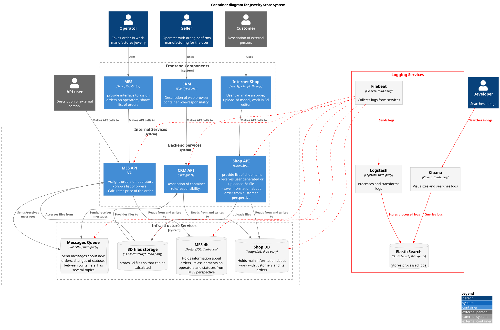

# Задание 4\. Логирование

# Контекст

В компании “Александрит” есть проблемы с софтом по созданию и обработке заказов: часть заказов либо не поступают на производство, либо не отправляются клиентам после. Проблемы именно в обработке заказов: производство не перегружено.  
Есть проблемы и с производительностью отдельных систем (MES).

Софт выполнен в виде набора микросервисов, из\-за чего найти источники сбоев бывает трудно. Централизованного сбора логов сейчас нет. Есть ли у разработчиков хоть какой-то доступ к логам на отдельных серверах – неизвестно.

Микросервисы взаимодействуют как с внешними пользователями, так и между собой (через REST API и через очередь RabbitMQ), а также со своими БД.  
Часть сервисов разработана с нуля внутри компании (Shop API, CRM), сервис MES API был куплен у сторонней фирмы и доработан внутри компании – т.е. это не чёрные ящики, доработка в принципе возможна, хотя и может быть трудоёмкой.

Причины сбоев при обработке заказов до сих пор не локализованы. Причин может быть несколько. Причины сбоев могут быть не только в коде Shop API, CRM или MES API, но и в других местах:

- в сетевых сбоях при передаче данных;  
- в неправильной настройке инфраструктуры (например, нехватка ресурсов для БД или брокера сообщений).

Команда разработчиков перегружена. Девопс сейчас один на всю компанию.

# Предлагаемое решение (кратко)

1. Развернуть Managed Kubernetes.  
2. Развёрнуть там ELK \+ filebeat (helm’ы от bitnami вполне годятся, количество реплик и выделяемые ресурсы там можно задавать).  
3. Перевести сервисы на Kubernetes.  
4. Начать собирать логи в ElasticSearch:  
   - собирать сырые логи со всех сервисов (как собственной разработки, так и инфраструктурных 3rd-party) из их stdout+stderr,  
   - для каждого сервиса логировать свой набор событий.  
5. Включить логирование для инфраструктурных сервисов (S3, Postgres, RabbitMQ).  
6. Разработчикам – дорабатывать собственные сервисы компании для более детального и настраиваемого логирования, насколько хватает сил у имеющихся и новых разработчиков (обычно логирование дорабатывается параллельно с поисками багов).  
7. Импортировать старые логи сервисов в ELK (какие сохранились).  
8. Как только у собственных сервисов будет включен JSON-мониторинг – поддержать парсинг JSON-логов c помощью filebeat в отдельные индексы (для более удобной фильтрации по log level).

# Мотивация

Главная задача логирования – помочь разработчикам быстро обнаруживать программные сбои и локализовывать их причины, чтобы сервис работал надёжно.

Из-за ненадёжной обработки заказов компания уже несёт значительные потери.

* Прямые потери (за счёт возвратов денег клиентами-физиками).  
* Упущенная прибыль (срыв контрактов с крупными корпоративными клиентами).  
* Также это ущерб репутации (что будет какое-то время препятствовать заключению новых контрактов даже после того, как сервисы заработают надёжно).  
* Есть риски судебного преследования по ЗоЗПП.

Судя по описанию, в системах обработки заказов явно есть критические баги, которые крайне трудно выявить и локализовать без удобного сбора и анализа логов.

Внедрение централизованного сбора логов потребует сил и времени (ближайший квартал), однако является неизбежным, если мы хотим добиться приемлемой надёжности системы и тем улучшить наши бизнес-показатели.

* Снизить процент отменённых заказов (когда клиент не дождался поставки и вернул деньги, т.е. прямые финансовые убытки).  
* Снизить процент т.н. “ручных эскалаций” (когда заказы ищут в базе вручную).  
* Снизить среднее время выполнения заказа (за счёт предыдущего пункта).  
* Уменьшить число отрицательных отзывов от клиентов и тем улучшить репутацию компании.  
* Увеличить число вернувшихся клиентов.

В более долгосрочной перспективе (от 1 года) – централизованный сбор логов поможет ускорить разработку сервисов и окупить операционные издержки на его реализацию.

# Предлагаемое решение (подробно)

## Сохранение сырых логов

Первым шагом после перехода на Kubernetes и развёртывания ELK \+ filebeat должен стать сбор сырых логов от всех pod’ов из тех кубер-пространств, где находятся сервисы MES API, CRM, ShopAPI, а также инфраструктурные сервисы (S3, RabbitMQ, Postgres).

Всё, что наши сервисы (собственные и 3rd-party) печатают в stdout и stderr, должно сохраняться как сырые логи в специальных индексах, и начать стоит именно с этого.

Поля сырых логов:

* namespace  
* pod\_name: имя пода  
* timestamp: временная метка сообщения  
* is\_error: признак того, из stdout это прочитано или из stderr  
* message: текст сообщения из stdout/stderr без какого-либо парсинга

Это можно сделать с помощью filebeat (он может собирать такие логи со всех подов в заданных пространствах и передавать в Logstash для дальнейшей обработки в ElasticSearch.

Каждый месяц мы будем формировать новый индекс, длительность хранения не менее 2 месяцев.

### Мотивация

Это решение даст:

- возможность сравнительно удобного поиска по той диагностике, что сервисы уже сейчас выводят в консоль;  
- возможности не дожидаться, пока во всех сервисах будут поддержано правильное форматирование логов;  
- заранее известное время хранения логов от сервисов;  
- хоть какое-то сохранение логов в ELK, если в сервисах они окажутся в неправильных или нестандартных форматах – и парсер не сможет их прочитать.

## Логи инфраструктурных сервисов

Второй шаг – включение логирования инфраструктурных сервисов (minio, postgres и RabbitMQ это позволяют).

### Для всех инфраструктурных сервисов

Для всех сервисов нужно логировать когда сервис начал инициализацию, когда закончил инициализацию и был готов к приёму соединений, а также readiness probe. По конкретным сервисам – ниже.

### Postgres

#### ERROR

- стандартный набор ERROR-сообщений от Postgres;  
- любые сообщения о сбоях Postgres 

#### WARNING

- стандартный набор WARNING-сообщений от Postgres  
- сообщения о долго обрабатывающихся запросах (по log\_min\_duration\_statement);  
- сообщения о запросах, вызвавших ошибку (сам запрос, IP клиента, текст ошибки);  
- сообщения о deadlock и lock\_waits.

#### INFO

- сообщения о подключении / отключении соединений;  
- любые DDL-операции (для аудита);

#### DEBUG

- текст SQL-запросов.

### S3-хранилище

#### ERROR

- стандартный набор ERROR-логов от minio  
- любые сообщения о нехватке ресурсов (в т.ч. диска или ОЗУ);

#### WARNING

- стандартный набор WARNING-логов от minio;  
- сообщения о сбоях при multipart upload;  
- сообщения о сбоях при загрузке данных;  
- сообщения об ошибках аутентификации и авторизации;  
- сообщения о ненахождении файла по заданному пути.

#### INFO

- сообщения о событиях при multipart upload;  
- сообщения о загрузках;  
- сообщения о подключении/отключении пользователей;  
- любые audit events (IP, bucket, object, status, size)

### RabbitMQ

#### ERROR

- стандартный набор ERROR-логов от RabbitMQ,  
- ошибки плагинов;  
- все события о проблемах с диском/памятью;

#### WARNING

* стандартный набор WARNING-логов от RabbitMQ  
* ошибки аутентификации, отказы в доступе.  
* любые события, связанные с dead-lettering exchange.  
* любые NACK при попытке доставки сообщений

INFO:

* Появление нового сообщения (только метаданные, заголовки и размер).  
* Чтение сообщения из очереди (только метаданные, заголовки и размер).  
* Удаление сообщения по TTL  
* Broker start/stop, node join/leave кластера  
* Connection open/close (client, user, vhost, IP, TLS)  
* Channel open/close; consumer subscribe/unsubscribe

DEBUG:

* содержимое сообщений, записываемых и читаемых из очереди.

## Логи сервисов собственной разработки

Для сервисов собственной разработки часть событий уже логируется, но этого, скорее всего, недостаточно.

Нужно:

- включить JSON-форматирование логов, чтобы timestamp и log level были обязательными полями  
  - хинт: JSON-форматирование желательно сделать отключаемым, чтобы при разработке и отладке было удобнее читать логи в консоли в реальном времени;  
- покрыть логами все важные события и правильно распределить логи по уровням.

Что касается приоритетов. MES разрабатывают одни разработчики, а

Какие события логировать и с каким уровнем – ниже.

### Для всех собственных сервисов

#### ERROR

* Любые исключения должны логироваться с уровнем ERROR, traceback должен быть включен.  
* Ошибки типа 500, 404 и подобные должны логироваться.  
* Любые ошибки обращения к другим ресурсам должны логироваться с уровнем ERROR (разве что если предполагается много попыток обращения, и это не последняя)

#### WARNING

* Неудачные попытки подключения к другим ресурсам (timestamp, хост, порт, HTTP Method, Request Path, headers, текст ошибки с tracеback), если попыток предполагается много, и эта попытка не последняя.

#### INFO

* сервис начинает инициализацию (timestamp)  
* сервис закончил инициализацию и готов к работе (timestamp)  
* получено обращение по REST API (timestamp, IP клиента, ID сессии, ID клиента, аргументы и тело запроса, код возврата, время обработки, размер body ответа);  
* подключение к очередям и БД;  
* любое обращение сервиса к другому сервису по HTTP/HTTPS (timestamp, URL, аргументы обращения, размер body);  
* любое обращение к БД (timestamp, текст запроса, количество извлечённых данных);  
* получение сообщения из очереди (timestamp \+ само сообщение);  
* отправка сообщения в очередь (timestamp \+ само сообщение);  
* healthcheck probe самого сервиса (статус и timestamp);

По конкретным сервисам – ниже.

### MES API

ERROR

* любые ошибки открытия 3D-моделей, скачанных из S3  
* любые ошибки расчёта стоимости изготовления

WARNING:

* стоимость изготовления не укладывается в пороговые значения (timestamp, ID заказа, пути к 3D-моделям);  
* время расчёта стоимости более 20 минут (timestamp, ID заказа, пути к 3D-моделям)

#### INFO

* количество данных, выбранных из БД по запросу (сколько строк \+ указание на то, где в коде делался запрос к БД);  
* любое обращение к S3 Storage (timestamp, путь в S3, время загрузки из S3, размер загруженного файла, MD5-хеш загруженного файла)  
* начало расчёта стоимости производства (timestamp, ID заказа, пути к моделям)  
* конец расчёта стоимости производства (timestamp, ID заказа, хеши моделей, количество полигонов в моделях, длительность расчёта)  
* healthcheck probes БД и очереди;

#### DEBUG

* сами запросы к БД;  
* данные, выбранные из БД (в основных эндпоинтах);  
* полная распечатка HTTP Request, включая header’ы и body;  
* полные тексты HTTP Response, включая header’ы и body;

### Shop API

#### ERROR

* Любые сообщения о сбоях загрузки из Shop API в S3.  
* Любые сообщения о сбоях при чтении из S3 в Shop API.  
* Любые сообщения о недоступности очереди.  
* Сообщения о неудачной попытке публикации данных в очередь.  
* Сообщения о неудачной попытке чтения данных из очереди.

#### WARNING

* Сообщения о сбоях частей multipart upload при загрузке 3D-модели от пользователя на Shop API.

#### INFO

* Начало и конец multipart upload при загрузке 3D-модели от пользователя на сервис (timestamp, MD5-хеш, размер, имя файла, путь в S3).  
* Сообщения о подключении к очереди.  
* Сообщения о публикации сообщений в очередь.  
* Сообщения о чтении данных из очереди.

#### DEBUG

* Информация об отдельных частях multipart upload (от пользователя в Shop API и от Shop API в S3) (timestamp, имя файла, путь в S3, MD5-хеш части, размер части файла).  
* Полный текст сообщений в очереди  
* Полный текст HTTP Request  
* Полный текст HTTP Response

### CRM

#### ERROR

* Любые сообщения о недоступности очереди или БД.  
* Сообщения о неудачной попытке публикации данных в очередь.  
* Сообщения о неудачной попытке чтения данных из очереди.

#### WARNING

* Сообщения о подключении к очереди.  
* Сообщения о публикации сообщений в очередь.  
* Сообщения о чтении данных из очереди.

INFO

* Сообщения о срабатывании метода синхронизации данных с Shop API (т.е. поиск новых заказов по расписанию) (timestamp, ID найденных новых заказов)  
* Сообщения о вызовах методов обработки заказов при поступлении данных из очереди (когда синхронизация с Shop API будет через очередь) (timestamp, ID новых заказов).

#### DEBUG

* Полный текст сообщений в очереди  
* Полный текст HTTP Request  
* Полный текст HTTP Response

## Политика безопасности при работе с логами

### Для сервисов собственной разработки

Сервисы должны маскировать чувствительные данные (например, заменять полное ФИО или телефон клиента на телефон вида \+79895\*\*\*9836) или токенизировать их перед отправкой в лог. Ответственность за это возлагается на разработчиков.

### Для 3rd-party-сервисов

Чувствительные данные внутри сервисов должны храниться в зашифрованном виде. Но: основной вид поиска в логах всё равно ожидается по order\_id и order\_status, а эти поля поле точно будет храниться как есть.

### Контроль доступа к логам

Доступ к техническим логам должны иметь девопсы (полный доступ через специальную учётку с ограниченным действием) и разработчики (доступ через Kibana).

При доступе через Kibana ограничивается максимальный объём скачиваемых логов, так что массивной утечки данных со стороны разработчиков не ожидается (считаем, что разработчики не имеют прямого доступа к промышленной среде, а девопсы не станут править код, отвечающий за логирование).

Все поиски в логах должны протоколироваться для аудита.

## Политика хранения логов

### Именование индексов (пример)

* shop-raw-{[YYYY.MM](http://YYYY.MM)} (для сырых логов сервиса Shop API без разделения на уровни логирования, где есть только timestamp и message)  
* shop-parsed-debug-{[YYYY.MM](http://YYYY.MM)} (для JSON-логов с уровнем логирования DEBUG и выше, где есть timestamp, log\_level, message)  
* shop-parsed-info-{[YYYY.MM](http://YYYY.MM)} – (для JSON-логов с уровнем логирования INFO и выше, где есть timestamp, log\_level, message)  
* shop-parsed-warning-{[YYYY.MM](http://YYYY.MM)} – (для JSON-логов с уровнем логирования WARNING и выше, где есть timestamp, log\_level, message)  
* shop-parsed-error-{[YYYY.MM](http://YYYY.MM)} – (для JSON-логов с уровнем логирования ERROR где есть timestamp, log\_level, message)

Для остальных сервисов, включая инфраструктурные сервисы, именуемся аналогично.  
Переходим на новый индекс раз в месяц.

### Сроки хранения

- сырые логи и DEBUG: 2 месяца  
- INFO и WARNING: 6 месяцев  
- ERROR: 12 месяцев

### Целевой объём логов

Целевой общий объём логов – не более 500 Тб в месяц, чтобы логи за 3 месяца влезали в в стандартный SSD на 2Тб. Если объём получается больше – стоит что-то порезать.  
Скорее всего, столько и близко не получится, если мы не будем постоянно гонять продуктовые сервисы в DEBUG-режиме.

## Автоматический анализ логов и алертинг

Имеет смысл сразу пересылать на специальный email только самые критические ошибки.

* Ошибки расчёта в MES.  
* Ошибки загрузки моделей из S3-хранилища.  
* Ошибки верхнего уровня в веб\-сервисах  
* Ошибки недоступности БД или очереди.

Остальное лучше делать через Prometheus \+ Grafana Alerting.

В перспективе имеет смысл подключить к анализу логов ML-систему, чтобы выявлять связанные записи в разных индексах, а также связывать логи с телеметрией.

### Детекция аномалий

Прежде всего стоит отслеживать аномальный рост размера индексов.  
Остальные аномалии пока будем отслеживать через Grafana Alerting.

# Приоритетность работ

Логирование стоит сделать задачей более приоритетной, чем метрики и трассировку:

- даже если трассировка укажет ошибку, нам всё равно нужно смотреть логи, чтобы уточнить детали;  
- метрики помогут понять, в какие мометны сервисы были перегружены или не работали, но всё равно не помогут локализовать конкретные ошибки;  
- старый добрый поиск в логах будет полезен даже без метрик и без трассировки (особенно логи правильно настроены, и ID заказа ищется в логах всех сервисов).

## Для девопс-инженеров

Для девопсов предлагаю такой порядок действий:

- развёртывание Kubernetes-кластера (managed);  
- развёртывание ELK;  
- настройка сбора сырых логов от заданных пространств;  
- перевод сервисов в Kubernetes одного за другим (с проверкой, что всё работает, а сырые логи от него собираются);  
- импорт в ELK старых логов от сервисов (какие сохранились);  
- настройка парсинга JSON-логов (когда таковые появятся).

### Какие сервисы переводить в Kubernetes в первую очередь?

Подозреваю, что это задача явно из довоенного времени, но собственные сервисы на EC2 предлагаю переводить в первую очередь, пока их не отключили (начиная с MES, которому нужно выдать самую производительную ноду, какая найдётся, и протестировать, что он точно работает не медленнее, чем раньше).

## Для разработчиков

Улучшенную поддержку логирования можно начать реализовывать, не дожидаясь переноса сервиса в Kubernetes:

- включить JSON-форматирование логов в своём сервисе;  
- включить логирование всех событий по спецификации в своих сервисах.

#### Какие сервисы покрывать логами в первую очередь?

Учитывая, что единственный разработчик на C\# и так разрабатывает MES API, он и будет покрывать логами MES API, начиная с той части, которая взаимодействует с CRM API и очередью.

Java-разработчики должны приоритетном порядке покрыть ту часть CRM API и Shop API, которая взаимодействует с MES, а затем тот функционал Shop API, который отвечает за синхронизацию данных с CRM API, затем функционал CRM API, который отвечает за синхронизацию данных с Shop API.

Остальные подсистемы – только после них.

# Плюсы и минусы выбранного решения

## Минусы

* Нужно **срочно** нанимать новых девопсов (2-3 человека с опытом работы с Kubernetes).  
* Крайне желательно нанять дополнительных разработчиков (1 Java, 1 C\#), т.к. команда разработчиков уже перегружена текущими задачами.  
* Сбор логов начнётся не сразу, а по мере перехода на Kubernetes.  
* Разработчикам нужно придётся учиться работать с Kubernetes (а желательно – и отлаживаться внутри тестовой Kubernetes-среды с помощью VNC или SSH-отладки).

## Плюсы

* Не нужно устанавливать отдельный сборщик логов для каждого сервиса вручную (трудоёмко и не очень надёжно).  
* Переход на Kubernetes очень облегчит горизонтальное масштабирование сервисов. Учитывая, что расчёты в MES по каждому украшению занимают много времени – удобное горизонтальное масштабирование нам очень ценно.  
* Пока идёт переход в Kubernetes, можно дорабатывать логирование в самих сервисах.

# Альтернативы

## Отказаться от перехода на Kubernetes

Этот вариант предлагает использование Yandex Managed Service For OpenSearch на “Яндекс-Облаке” (вариант “разворачивать ELK голыми руками” не рассматриваем как негуманный и с очень негарантированным успехом).

### Плюсы

* Можно начать собирать логи для какой-либо системы, не откладывая дело в долгий ящик.

### Минусы

* Придётся вручную настраивать сбор логов для каждой конкретной системы, и в сумме мы тоже потеряем время, сравнимое с Kubernetes но не получим всех прелестей Kubernetes в виде удобного масштабирования и лёгкого развёртывания новых сервисов.  
* Придётся открывать API ElasticSearch вовне, чтобы filebeat на конкретных сервисах мог к нему подключаться (лишние проблемы с безопасностью).

# Диаграмма контейнеров

_Диаграмма контейнеров с добавленными сервисами логирования_

Новые подсистемы и связи выделены красным.

Исходную диаграмму контейнеров -- см. в [../container_diagram.puml](../container_diagram.puml) или [../container_diagram.svg](../container_diagram.svg) 