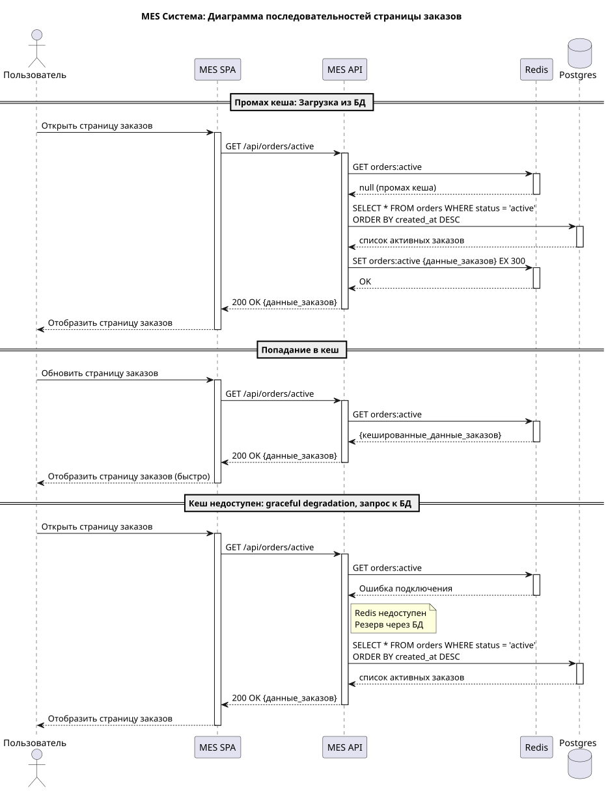

# Задание 5. Кэширование

## Мотивация

Производительность MES перестаёт удовлетворять требованиям бизнеса:

- операторы жалуются, что главная страница MES, где показан список новых заказов, очень долго прогружается;  
- расчёт стоимости производства занимает продолжительное время (2-3 минуты в среднем, но может достигать и 30 минут для сложных моделей);  
  - о паралельном расчёте стоимости разных заказов в задании ничего не сказано, так что будем считать, что его пока нет.

Количество заказов постоянно растёт, когда решатся проблемы с потерей заказов – ожидается ещё больший рост.

Нам нужно:
- ускорить обработку заказов;  
- увеличить производительность труда операторов;  
- улучшить клиентский опыт за счёт того, что расчёт стоимости будет происходить быстрее.

## Предлагаемое решение

Предлагаемое решение – комплексное (не только кэширование, но и, в перспективе разделение MES  на BFF, MES API и MES Price Calculator). Общий план ниже.

### Задачи для девопсов

* Развернуть Redis (3x master \+ 3x slave, из стандартного helm chart от bitnami).

### Кэширование фронтэнда и статики в MES API

* серверное кэширование \+ вынос на отдельный BFF-сервис;  
  * в качестве бэкэнда серверного кэширования – используем Redis (скорее всего, BFF-сервер это поддерживает)  
* включить клиентское кэширование картинок и JS, время жизни 15 минут;  
* если это будет по-настоящему долго – подумать о раздаче через внешний CDN.

### Кэширование списка актуальных заказов

Применим серверное кэширование, обновление кэша в отдельном потоке (разновидность Write-Behind, немного отличается от того, что описано в материалах):

* приложение обновляет кэш при любых получении обновлений заказов, полученных как через очередь от CRM API, так и от оператора или от внешнего клиента через REST API,  
* важно: крайне желательно использовать паттерн Update Coalescing (т.е. если идёт пересчёта кэша ещё идёт, и за время его выполнения прилетело несколько обновлений заказов, то потом метод пересчёта кэша нужно запустить только 1 раз, а не по разу для каждого обновления);  
* производить проактивное обновление кэша при старте MES API;  
* если по какой-либо причине не удалось подключиться к кэшу – просто читаем из БД, как раньше;  
* если по какой-то причине в кэше нет данных – читаем из БД, записываем данные в кэш;  
* опционально – добавить вызов обновления кэша раз в N минут (отключаемое в настройках, в качестве резервного метода)

На перспективу, если хочется уменьшить время пересчёта кэша, можно поработать со структурой БД:

- оптимизировать индексы;  
- разделить таблицы заказов на actual\_orders и archive\_orders (с одинаковой структурой).

#### Альтернативные способы кэширования для страницы актуальных заказов

Обновление кэша при чтении (классический Cache-Aside / Read-Through) нам не очень подходит, так как обновление может занимать достаточно долгое время, и количество промахов кэша хочется снизить.

Проактивное обновление кэша в стиле Read-Ahead подходит лучше, но хочется ещё и сократить время, когда на странице списка заказов демонстрируются устаревшие данные (т.е. сделать так, чтобы от создания заказа до публицации проходило ровно столько времени, сколько нужно на пересчёт кэша).

Очищать кэш при любом обновлении данных тоже не стоит: ситуация, когда данные на главной странице немного отстают от данных в БД (на время, потребное на пересчёт кэша), выглядит допустимой. Если же мы будем очищать кэш, то пользователь всё равно не сможет прочитать новое состояние страницы сразу: ему понадобится для этого подождать точно такое же время обновления кэша (или даже больше, т.к. БД будет ещё и перегружена). Но в это время ему тогда будут показывать не устаревшее состояние главной страницы, а вообще ничего, кроме надписи “ждите”.

Хинт: в материалах курса описаны такие разновидности Write-Behind и Write-Ahead, когда кэш сам пишет в БД, но postgres не имеет встроенных механизмов работы с кэшем. Здесь немножко не так, но всё равно будем считать, что это ещё Write-Behind ))

### Кэширование расчёта цен в MES API

- серверное кэширование, по принципу Cache-Aside, время жизни от 1 месяца;  
- ключ – MD5-хеш модели, значение – стоимость расчёта;  
- предусмотреть метод инвалидации кэша, как для отдельных моделей, так и для всех моделей (например, если у нас подросли расценки из\-за общей инфляции на рынке или изменился алгоритм расчёта цен от полигонов).

Важно: скорее всего, **кэширование метода расчёта цен в MES API не станет панацеей,** так как “Александрит” работает, прежде всего, на заказ. Даже если пользователь не загружал собственную модель, а собрал её из из моделей-примитивов в 3D-редакторе на сайте – скорее всего, вариативность будет очень велика, и полных дублей будет не так много (меньше половины).

На ближайшую перспективу – расчёт стоимости изделия стоит вынести из MES API в отдельный микросервис Price Calculator, который будет запущен в нескольких экземплярах. Экземпляры должны получать задания из топика очереди, результаты расчёта записывать в другой топик очереди.

## Диаграммы последовательностей
### Для чтения страницы заказов

_Диаграммы последовательностей для чтения страницы заказов_

Здесь показан сценарий чтения страницы заказов с использованием кэша:
* в случае попадания в кэш (нормальный сценарий);
* в случае ненахождения данных в кэше
* в случае недоступности данных в кэши (graceful degradation)

### Для обновления заказов
![Диаграммы последовательностей для обновления заказов](https://www.plantuml.com/plantuml/png/xLPTQnD157tVNt693rMXDBRgmqA4cgvLj7J99gXG26DscYoKJTZTweCKcYgejABqHPyiHN_0MXiQqw-_CFEFl7Ss7xkRf7uK5S67J3OxTywzSywTCmcSO8N3Wc61s1LjsPGReYMEHAY3-20-YsDn8lR48Rux5ctH0XKGoWtvJ3P52E90XAA3dmEAqpHM2UeUP73fgMZ9TOeK9t8z0yo7aiyzhS6ymAau3UO6aA6ibZchPl5xU7BMlAClkOZGx1P2urT0y1C25Xsr5ACqcmNi4VCvPCow7rGzxgifSpusK-2s4xrMJsFJzT41XnG5yWs8ZdmjNufG8ULPfSQBDOypMzDoEH0xQjzxkAOrOZcz750MGYwdQSGBJDuW1f3qz_Z-g9jhGsub24-klN1bUeO8TnwpW2l-D1m8YVO1Pga8KwpXJDKzctl-54R3KpzWmQgleqBRGF9WVRJNLcPjW4HqQZWGaZclGycScoqQ4C60PHGXGe4SJAHW9k3-RQDWW6FZPA8y5CASXybUSLOfdpSiIxDvF49pw_ZWETLQ0FNbA5BiO09Ya6Z5hODyZcI6uWkzHBKg941vjO4oEswrxDQVOEfbjkBp_YPY6Y7UErnyIcnYmH75esNgO4PKUR25XDJ9IfCPFdKBR8yhB_1MUM-gnlnoWxispLPgpAroFxM1NcjCPxEmU3TEcL9AQOunr4QOV3VUBgcDnTUgVedLtLFRCkuP-I9SXbk5nOMUw96g0zaL2fzOSXSBSqO1RZw42c84t2wp0EOCApzA-2H9sCTK9NuVoYrnB3SJHqDkfbiZLQewmRhgngX6FQe9dWwfgR3BOXznkp_Mm7W0CzdieCh84DGuN6kIz2ZqV0sWvFsX3eWb7hAQxSXSnrlDHV8X47iOWvvErdNQToSyFvVEPpzNhrt_2Vl1wBZzq2bKPnhF66RxPVz9uIGCA57WdpKWEk6ZqJv6Z2B1eTAgZMD8ylHnzRCR8uB-tSv0_VKMEuVkmIDrZRVb2wIWYHIqeokufThge6Uduw_Bo4XLivrrQdOKtZuUq7t4UuNFPzsWFT7RE87_3-GMNjmffNJuFez_qzt_k-y_whxV0000)
_Диаграммы последовательностей для обновления заказов_

На этих диаграммах -- сценарий обновления кэша при обновлении заказов. 

* Операторы из MES SPA вызывает в MES API какой-то метод (например, UPDATE api/order или PUT api/order), изменяющий статус заказа. Вызвать этот метод они могут несколько раз подряд. Этот этот же обработчик вызывается и при получении сообщений от CRM (о появлении новых оплаченных и утверждённых заказов).
* При каждом таком вызове MES API обращается в БД  Postgres и обновляет там информацию о заказах (будем считать, что это происходит довольно быстро), выставляет флаги пересчёта кэша и возвращает пользователю код 200. 
* Обновление кэша читает собирает данные об актуальных заказах из БД и записывает данные в Redis.

Пересчёт кэша делается в отдельном потоке. Для управления пересчётом кэша используются два флага (чтобы сделать свёртку обновлений aka update coalescing):
* `cache_updating_now` (при старте выключен);
* `cache_has_pending_changes` (при старте включен).

Когда MES API вернуло пользователю код 200 и обновило данные в БД, то наша программа должна проверить: не идёт ли сейчас обновление кэша (cache_updating_now). Если обновление кэша уже идёт, то новое обновление кэша должно начаться только тогда, когда прежнее обновление досчитается (выставляем флаг cache_has_pending_changes).

- Когда начинается новое обновление кэша, то выставляется флаг `cache_updating_now` и убирается `cache_has_pending_changes`
- Когда заканчивается очередное обновление кэша, то убирается флаг cache_updating_now и проверяется, не выставлен ли флаг cache_has_pending_changes (если выставлен, то сразу запустим обновление кэша).

Также показан дополнительный метод обновления кэша по времени (на нижней поддиаграмме).